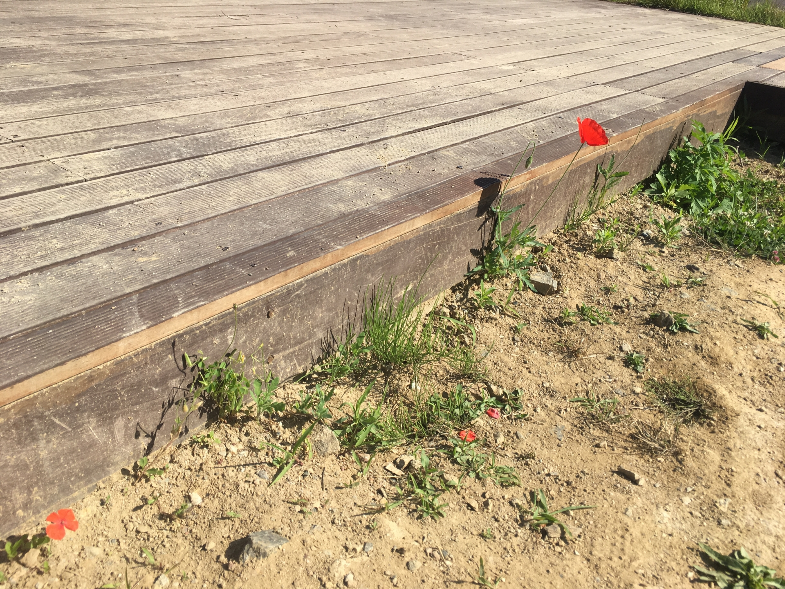

# Logical-Poet
2K image TO 12K painting.


<div align='center'>
  
</div>

<div align='center'>
  
</div>
IMAGE taken iPhoneSE to 4K painting sample

## Dependency

 Torch , Pytorch, G'MIC, UBUNTU 16.04 (UBUNTU 14.04)

[texture_net](https://github.com/DmitryUlyanov/texture_nets)

[G'MIC filter](http://gmic.eu/gimp.shtml)
```
sudo add-apt-repository ppa:otto-kesselgulasch/gimp-edge

sudo apt-get update

sudo apt-get install gmic gimp-gmic
```
[ImageMagick](http://www.imagemagick.org/script/index.php)

[waifu2x](https://github.com/nagadomi/waifu2x)

[pytorch/examples](https://github.com/pytorch/examples/tree/master/super_resolution)


## Road 


1. making 6k painting
```
bash hy.sh
```
(result in /s11)

2. making 12k painting

paste s11's 6k images to waifu2x install folder (needed Installation) 

and

go to waifu2x folder

```
bash folder.sh
```
(copy and paste as folder.sh to waifu2x folder)

(result in waifu2x/s)


##  examples

tested in 1600 * 896 using GTX1080 and c920r


## Usage (2.CameraTesting)

dependency

`luarocks install camera`

`luarocks install qtlua`

RUN

`qlua camtest.lua -model_t7 data/frog.t7`

## Attributions/Thanks

DmitryUlyanov's [texture_net](https://github.com/DmitryUlyanov/texture_nets) and Justin Johnson's [Fast Neural Style](https://github.com/jcjohnson/fast-neural-style)


## frog painting

Frog.jpg is my daughter's piece in 2017.

## Citation

If you find this code useful for your research, please cite:

```
  @misc{seominlee 2017,
  author = {Seomin, Lee},
  title = {Logical-Poet},
  year = {2017},
  publisher = {GitHub},
  journal = {GitHub repository},
  howpublished = {\url{https://github.com/seominlee//Logical-Poet}},
  }
```


## License

Free for personal or research use; for commercial use please contact me.

